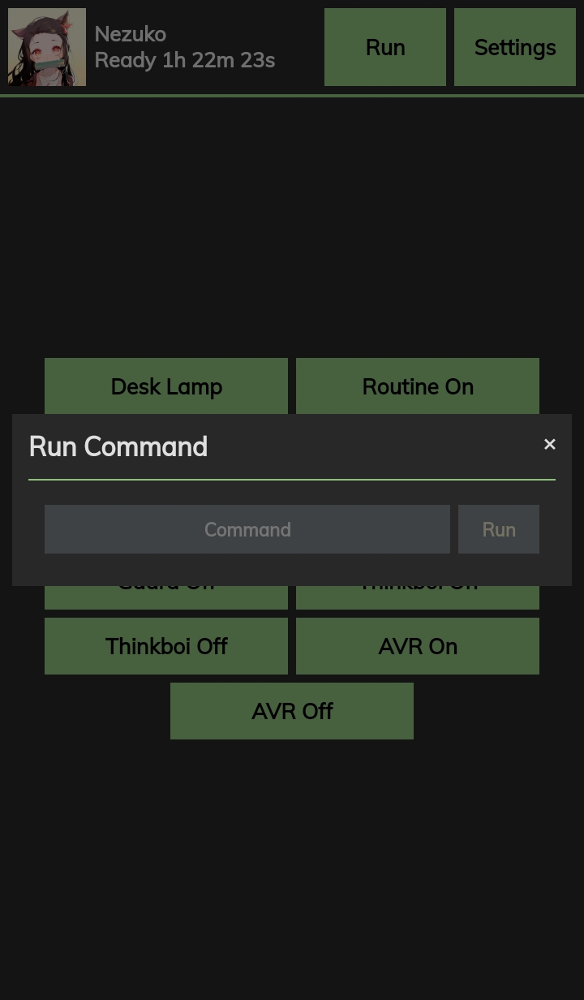

<!------------------------- PROJECT LoggerO ------------------------->
<br />
<p align="center">
  <a href="https://github.com/callmekory/nezuko">
    
  </a>

<h2 align="center"><b>Nezuko</b></h2>

  <p align="center">
    Smart Home, Automation, and all purpose server management bot.
    <br />
    <br />
    <a href="https://github.com/callmekory/nezuko/issues">Report Bug</a>
    ·
    <a href="https://github.com/callmekory/nezuko/issues">Request Feature</a>
  </p>
</p>

<!------------------------- ABOUT THE PROJECT ------------------------->

<h2 align="center"><b>About The Project</b></h2>

I made Nezuko to automate and simplify my life. From controlling lights and smart plugs to media management and Docker control. If its not here it'll be here. Feel free to PR and ask for new features!

<!------------------------- COMMANDS ------------------------->

<h2 align="center"><b>Commands</b></h2>

| Command    | API | Description (Click for full details)                                                                                                                                                                                                                                                                                                                                                                                                                                                                                                                                                                                      |
| ---------- | :-: | ------------------------------------------------------------------------------------------------------------------------------------------------------------------------------------------------------------------------------------------------------------------------------------------------------------------------------------------------------------------------------------------------------------------------------------------------------------------------------------------------------------------------------------------------------------------------------------------------------------------------- |
| archivebox |  Y  | <details><summary>Clone webpages via ArchiveBox</summary><p>Commands:<p><ul><li><b>[ url ]</b> - Url to add</li></ul></details>                                                                                                                                                                                                                                                                                                                                                                                                                                                                                           |
| autorun    |  Y  | <details><summary>Schedule commands to auto run at specified times</summary><p>Commands:<p><p>Times should follow the format [ 10:00pm 1:25am etc ]</p></br><ul><li><b>list</b> - List all auto commands</li><li><b>add [ time ][ command ]</b> - Add command to autorun</li><li><b>remove [ time ][ command ]</b> - Remove command from autorun</li><li><b>disable [ time ][ command ]</b> - Disabled a autorun command</li><li><b>enable [ time ][ command ]</b> - Enable a autorun command</li><li><b>changetime [ old time ][ new time ]</b> - Change the run time for the commands</li></ul></details>               |
| avr        |  Y  | <details><summary>Pioneer AVR controller</summary><p>Commands:<p><ul><li><b>on/off</b> - Power on/off</li><li><b>vol</b> - Show current volume</li><li><b>vol [ 0-100 ]</b> - Set AVR volume</li></ul></details>                                                                                                                                                                                                                                                                                                                                                                                                          |
| docker     |  Y  | <details><summary>Manage Docker contaienrs</summary><p>Commands:<p><ul><li><b>list [ running/paused/exited/etc ]</b> - List containers</li><li><b>stop/start/restart/etc [ container name ]</b> - Manage container states</li></ul></details>                                                                                                                                                                                                                                                                                                                                                                             |
| emby       |     | <details><summary>Get stats from Emby</summary><p>Commands:<p><ul><li><b>stats</b> - Media library stats</li><li><b>recent [ movies/series/music ]</b> - View recent media and get links to watch</li><li><b>streams</b> - View who and whats currently streaming</li></ul></details>                                                                                                                                                                                                                                                                                                                                     |
| ip         |  Y  | <details><summary>Shows server public and local IP</summary></details>                                                                                                                                                                                                                                                                                                                                                                                                                                                                                                                                                    |
| jackett    |     | <details><summary>Search for torrents via Jackett</summary><p>Commands:<p><ul><li><b>[ search term ]</b> - Torrent to search for</li></ul></details>                                                                                                                                                                                                                                                                                                                                                                                                                                                                      |
| lamp       |  Y  | <details><summary>Sengled light controller</summary><p>Commands:<p><ul><li><b>list</b> - List all lights</li><li><b>[ light name ]</b> - Toggle light on/off</li><li><b>[ light name ][ on/off ]</b> - Set light state</li><li><b>[ light name ] 0-100</b> - Set light brightness</li></ul></details>                                                                                                                                                                                                                                                                                                                     |
| meraki     |  Y  | <details><summary>Meraki network statistics</summary><p>Commands:<p><ul><li><b>list</b> - List all devices on network</li></ul></details>                                                                                                                                                                                                                                                                                                                                                                                                                                                                                 |
| movie      |     | <details><summary>Search and request movies in Ombi</summary><p>Commands:<p><ul><li><b>[ movie name ]</b> - Movie to search for</li></ul></details>                                                                                                                                                                                                                                                                                                                                                                                                                                                                       |
| pc         |  Y  | <details><summary>Linux system power controller</summary><p>Commands:<p><ul><li><b>on/off/restart</b> - State to set system</li></ul><p>Requires addon in core/addons/powerserver to be running on the system you want to control.</p></details>                                                                                                                                                                                                                                                                                                                                                                          |
| pihole     |  Y  | <details><summary>PiHole management</summary><p>Commands:<p><ul><li><b>stats</b> - List usage statistics</li><li><b>on/off</b> - Enable/disable DNS filtering</li></ul></details>                                                                                                                                                                                                                                                                                                                                                                                                                                         |
| plex       |     | <details><summary>Get stats from Plex via Tautulli</summary><p>Commands:<p><ul><li><b>stats</b> - Media library stats</li><li><b>recent [ movies/series/music ]</b> - View recent media and get links to watch</li><li><b>streams</b> - View who and whats currently streaming</li></ul></details>                                                                                                                                                                                                                                                                                                                        |
| plug       |  Y  | <details><summary>Tuya smartplug controller</summary><p>Commands:<p><ul><li><b>list</b> - List all devices from config</li><li><b>[ device name ]</b> - Toggle device on/off</li><li><b>[ device name ][ on/off ]</b> - Set device state</li></ul></details>                                                                                                                                                                                                                                                                                                                                                              |
| rclone     |  Y  | <details><summary>List directories and get info on your rclone mounts</summary><p>Commands:<p><ul><li><b>ls [ /some/rclone/dir ]</b> - List files in a dir and navigate in pages</li><li><b>size[ /some/rclone/dir ]</b> - Get the size of a dir on rclone</li></ul></details>                                                                                                                                                                                                                                                                                                                                            |
| routines   |  Y  | <details><summary>Routines to run multiple commands at once</summary><p>Commands:<p><ul><li><b>list</b> - List all routines</li><li><b>add [ routine name ][ command ]</b> - Add command to routine</li><li><b>remove [ routine name ][ command ]</b> - Remove command from routine</li><li><b>run [ routine name ]</b> - Runs specified routine</li><li><b>disable [ routine name ][ command ]</b> - Disabled a command inside a routine</li><li><b>enable [ routine name ][ command ]</b> - Enable a command inside a routine</li><li><b>rename [ routine name ][ new name ]</b> - Rename a routine</li></ul></details> |
| sab        |  Y  | <details><summary>sabNZBD Management</summary><p>Commands:<p><ul><li><b>list</b> - List all downloads in queue</li><li><b>add</b> - Add NZB's via link</li></ul></details>                                                                                                                                                                                                                                                                                                                                                                                                                                                |
| say        |  Y  | <details><summary>Speak through Google Home</summary><p>Commands:<p><ul><li><b>say [ wake up my g ]</b> - Text to be spoken</li></ul></details>                                                                                                                                                                                                                                                                                                                                                                                                                                                                           |
| series     |     | <details><summary>Search and request TV shows in Ombi</summary><p>Commands:<p><ul><li><b>[ series name ]</b> - Series to search for</li></ul></details>                                                                                                                                                                                                                                                                                                                                                                                                                                                                   |
| speedtest  |     | <details><summary>Runs a internet speedtest on the host the bot is running on</summary></details>                                                                                                                                                                                                                                                                                                                                                                                                                                                                                                                         |
| todo       |  Y  | <details><summary>Your personal todo list</summary><p>Commands:<p><ul><li><b>list</b> - List all todos</li><li><b>add [ take out trash ]</b> - Add a todo</li><li><b>remove [ # ]</b> - Remove a todo</li></ul></details>                                                                                                                                                                                                                                                                                                                                                                                                 |
| tor        |  Y  | <details><summary>Transmission Management</summary><p>Commands:<p><ul><li><b>list</b> - List all downloads in queue</li><li><b>add [ magnet link ]</b> - Add Torrent via link</li></ul></details>                                                                                                                                                                                                                                                                                                                                                                                                                         |
| yt         |     | <details><summary>Search Youtube for videos</summary><p>Commands:<p><ul><li><b>[ search term ]</b> - Video to search for</li></ul></details>                                                                                                                                                                                                                                                                                                                                                                                                                                                                              |

<!------------------------- Web UI ------------------------->

Nezuko has a built in web UI / API server for remotely running commands. For API enabled commands you can add them as buttons on the Web UI send HTTP POST requests from your favorite applications. I personally use HTTP Request Shortcuts on my Galaxy. It has a nice UI with support for custom icons, etc.

<div align="center">




</div>

<!------------------------- GETTING STARTED ------------------------->

<h2 align="center"><b>Prerequisites</b></h2>

To get a local copy up and running follow these simple steps.

1. Clone Nezuko

```sh
git clone https://github.com/callmekory/nezuko.git
```

2. Install Yarn

Ubuntu / Debain

```sh
curl -sS https://dl.yarnpkg.com/debian/pubkey.gpg | sudo apt-key add -

echo deb https://dl.yarnpkg.com/debian/ stable main" | sudo tee /etc/apt/sources.list.d/yarn.list

sudo apt install yarn
```

Arch Linux

```sh
sudo pacman -S yarn
```

3. Install packages

```sh
> yarn install
```

<h2 align="center"><b>Setup</b></h2>

1. Setup Bot Token and Prefix

> Navigate to /nezuko/data and rename `config.js.sample` to `config.js`. Open the file and edit as needed.

2. Setup Command Configs

> All commands and other settings are setup after the bot is added to your server. Either by running `config get` which will list all the settings you can edit and how to edit them or by navigating to `http://botIP:5700` and setting up your details there. Everything is saved to the database at `/nezuko/data/db.sqlite`.

If you would like to run Nezuko as a Docker container you'll need to build the image yourself.

1. Clone the repo to a folder of choice
2. CD into the folder and inside the folder `data` rename `config.js.sample` to `config.js` and enter your discord user ID and your bot token.
3. Navigate back into the main directory and run `docker build -t nezuko .`
4. After the build is finished you can run Nezuko with `docker run -p 570:5700 --name nezuko nezuko`. If you'd rather use Docker-Compose as I do then you can use the following sample config. Simply save it as `docker-compose.yml` and run `docker-compose up -d` to start her up. The webUI will be available at `http://BOTIP:5700`.

```json
version: '3'
services:
  vscode:
    image: nezuko
    container_name: nezuko
    volumes:
      - ./config:/app/data # if you use a host directory for config make sure you copy the config.js file into it before running the bot
    ports:
      - 5700:5700
    network_mode: bridge
    restart: unless-stopped
```

<h2 align="center"><b>Roadmap</b></h2>

See the [open issues](https://github.com/callmekory/nezuko/issues) for a
list of proposed features (and known issues).

<!------------------------- CONTRIBUTING ------------------------->

<h2 align="center"><b>Contributing</b></h2>

Contributions are what make the open source community such an amazing place to
be learn, inspire, and create. Any contributions you make are **greatly
appreciated**.

1. Fork the Project
2. Create your Feature Branch (`git checkout -b feature/AmazingFeature`)
3. Commit your Changes (`git commit -m 'Add some AmazingFeature'`)
4. Push to the Branch (`git push origin feature/AmazingFeature`)
5. Open a Pull Request

<!------------------------- LICENSE ------------------------->

<h2 align="center"><b>License</b></h2>

Distributed under the GPL3 License. See `LICENSE` for more information.

<!------------------------- CONTACT ------------------------->

<h2 align="center"><b>Contact</b></h2>

You can shoot me a PM on Discord if you have any question. My tag is Sublime#4233

<!------------------------- ACKNOWLEDGEMENTS ------------------------->

<h2 align="center"><b>Acknowledgements</b></h2>

- [Mellow - Ombi movies/series code](https://github.com/v0idp/Mellow)
- [nwithan8](https://github.com/nwithan8)
- [codetheweb/tuyapi](https://github.com/codetheweb/tuyapi)

<!------------------------- MARKDOWN LINKS & IMAGES ------------------------->
