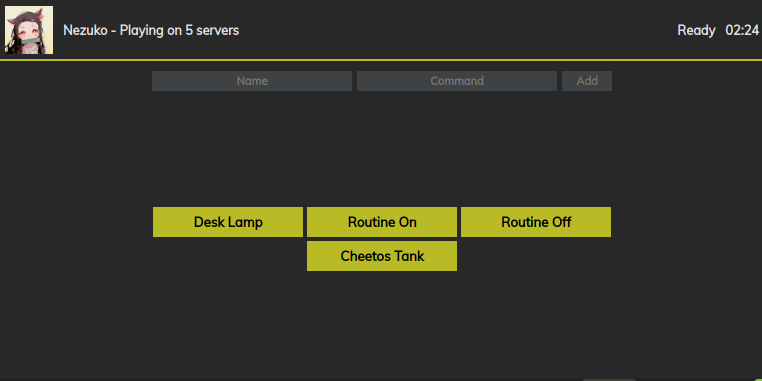
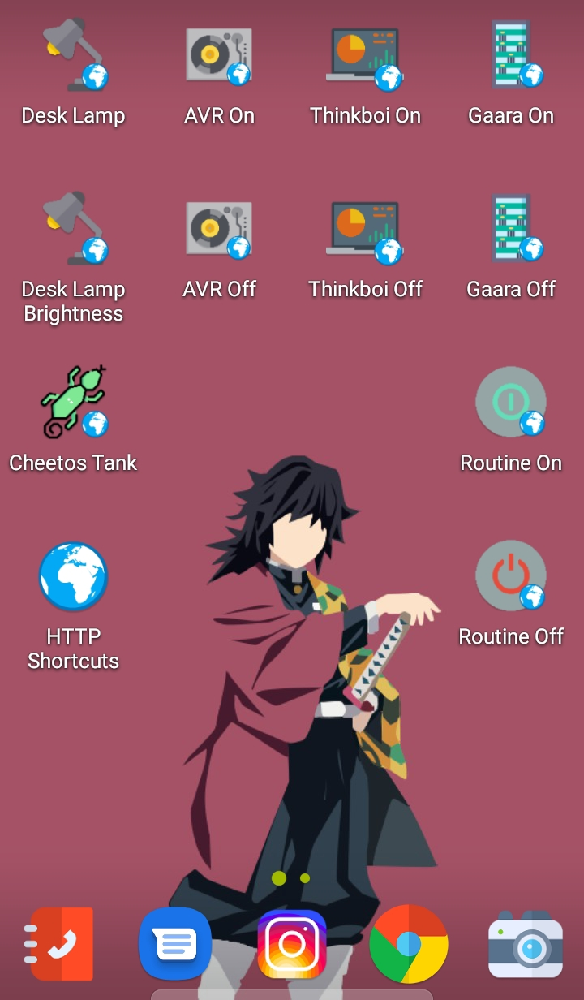
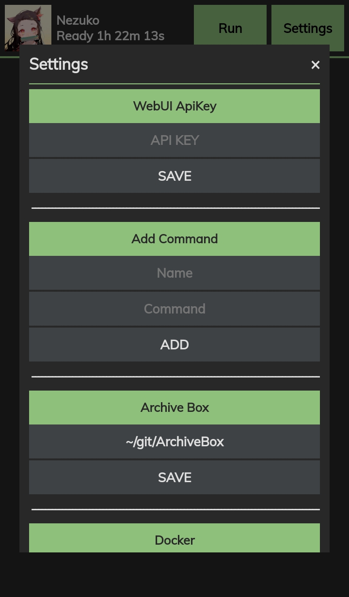

   

<!-- PROJECT LOGO -->

 

  

<strong><h2 align="center">Nezuko</h2></strong>

  

    Smart Home, Automation, and all purpose server management bot.
     
     
    <a href="https://github.com/callmekory/nezuko/issues">Report Bug</a>
    ·
    <a href="https://github.com/callmekory/nezuko/issues">Request Feature</a>
  

<!-- ABOUT THE PROJECT -->
<h2 align="center"><b>About The Project</b></h2>

I made Nezuko to automate my life. From controlling my lights and smart plugs to media management and Docker control. If its not here it&#39;ll be here. Feel free to PR and ask for new features!

<h2 id="-commands-"><!-- COMMANDS --></h2>
<h2 align="center"><b>Commands</b></h2>

<table>
<thead>
<tr>
<th>Command</th>
<th style="text-align:center">Status</th>
<th style="text-align:center">API</th>
<th>Description (Click for full details)</th>
</tr>
</thead>
<tbody>
<tr>
<td>sab</td>
<td style="text-align:center">1.0</td>
<td style="text-align:center">Y</td>
<td>

sabNZBD Management

Commands:
<ul><li><b>list</b> - List all downloads in queue</li><li><b>add</b> - Add NZB&#39;s via link</li></ul>
</td>
</tr>
<tr>
<td>tor</td>
<td style="text-align:center">1.0</td>
<td style="text-align:center">Y</td>
<td>

Transmission Management

Commands:
<ul><li><b>list</b> - List all downloads in queue</li><li><b>add [magnet link]</b> - Add Torrent via link</li></ul>
</td>
</tr>
<tr>
<td>movie</td>
<td style="text-align:center">1.0</td>
<td style="text-align:center"></td>
<td>

Search and request movies in Ombi

Commands:
<ul><li><b>[movie name]</b> - Movie to search for</li></ul>
</td>
</tr>
<tr>
<td>series</td>
<td style="text-align:center">1.0</td>
<td style="text-align:center"></td>
<td>

Search and request TV shows in Ombi

Commands:
<ul><li><b>[series name]</b> - Series to search for</li></ul>
</td>
</tr>
<tr>
<td>emby</td>
<td style="text-align:center">1.0</td>
<td style="text-align:center"></td>
<td>

Get stats from Emby

Commands:
<ul><li><b>stats</b> - Media library stats</li><li><b>recent [movies/series/music]</b> - View recent media and get links to watch</li><li><b>streams</b> - View who and whats currently streaming</li></ul>
</td>
</tr>
<tr>
<td>plex</td>
<td style="text-align:center">1.0</td>
<td style="text-align:center"></td>
<td>

Get stats from Plex via Tautulli

Commands:
<ul><li><b>stats</b> - Media library stats</li><li><b>recent [movies/series/music]</b> - View recent media and get links to watch</li><li><b>streams</b> - View who and whats currently streaming</li></ul>
</td>
</tr>
<tr>
<td>archivebox</td>
<td style="text-align:center">1.0</td>
<td style="text-align:center">Y</td>
<td>

Clone webpages via ArchiveBox

Commands:
<ul><li><b>[url]</b> - Url to add</li></ul>
</td>
</tr>
<tr>
<td>rclone</td>
<td style="text-align:center">1.0</td>
<td style="text-align:center">Y</td>
<td>

List directories and get info on your rclone mounts

Commands:
<ul><li><b>ls [/some/rclone/dir]</b> - List files in a dir and navigate in pages</li><li><b>size[/some/rclone/dir]</b> - Get the size of a dir on rclone</li></ul>
</td>
</tr>
<tr>
<td>speedtest</td>
<td style="text-align:center">1.0</td>
<td style="text-align:center">Y</td>
<td>

Runs a speedtest on the host the bot is running on

</td>
</tr>
<tr>
<td>todo</td>
<td style="text-align:center">1.0</td>
<td style="text-align:center">Y</td>
<td>

Your personal todo list

Commands:
<ul><li><b>list</b> - List all todos</li><li><b>add [take out trash]</b> - Add a todo</li><li><b>remove [1]</b> - Remove a todo</li></ul>
</td>
</tr>
<tr>
<td>docker</td>
<td style="text-align:center">1.0</td>
<td style="text-align:center">Y</td>
<td>

Manage Docker contaienrs

Commands:
<ul><li><b>list running/paused/exited/etc</b> - List containers</li><li><b>stop/start/restart/etc [CONTAINER]</b> - Manage container states</li></ul>
</td>
</tr>
<tr>
<td>avr</td>
<td style="text-align:center">1.0</td>
<td style="text-align:center">Y</td>
<td>

Pioneer AVR controller

Commands:
<ul><li><b>on/off</b> - Power on/off</li><li><b>vol</b> - Show current volume</li><li><b>vol [0-100]</b> - Set AVR volume</li></ul>
</td>
</tr>
<tr>
<td>lights</td>
<td style="text-align:center">1.0</td>
<td style="text-align:center">Y</td>
<td>

Sengled light controller

Commands:
<ul><li><b>list</b> - List all lights</li><li><b>[light name]</b> - Toggle light on/off</li><li><b>[light name] 0-100</b> - Set light brightness</li></ul>
</td>
</tr>
<tr>
<td>plug</td>
<td style="text-align:center">1.0</td>
<td style="text-align:center">Y</td>
<td>

Meraki network statistics

Commands:
<ul><li><b>list</b> - List all devices on network</li></ul>
</td>
</tr>
<tr>
<td>pihole</td>
<td style="text-align:center">1.0</td>
<td style="text-align:center">Y</td>
<td>

PiHole management

Commands:
<ul><li><b>stats</b> - List usage statistics</li><li><b>on/off</b> - Enable/disable DNS filtering</li></ul>
</td>
</tr>
<tr>
<td>pc</td>
<td style="text-align:center">1.0</td>
<td style="text-align:center">Y</td>
<td>

Linux system power controller

Commands:
<ul><li><b>on/off/restart</b> - State to set system</li></ul>
Requires addon in core/addons/powerserver to be running on the system you want to control.

</td>
</tr>
<tr>
<td>routines</td>
<td style="text-align:center">1.0</td>
<td style="text-align:center">Y</td>
<td>

Routines to run multiple commands at once

Commands:
<ul><li><b>add [routine name][command]</b> - Add a command to a routine</li><li><b>remove [routine name][command # from list command]</b> - Remove a command from routine</li><li><b>disable/enable [routine name][command # from list command]</b> - Enable/disable a command in a routine</li><li><b>list</b> - List all your routines and commands</li></ul>
</td>
</tr>
<tr>
<td>ip</td>
<td style="text-align:center">1.0</td>
<td style="text-align:center">Y</td>
<td>

Shows server public and local IP

</td>
</tr>
<tr>
<td>say</td>
<td style="text-align:center">1.0</td>
<td style="text-align:center">Y</td>
<td>

Speak through Google Home

Commands:
<ul><li><b>say [waddup my dude]</b> - Text to be spoken</li></ul>
</td>
</tr>
</tbody>
</table>

<h2 id="-web-ui-"><!-- Web UI --></h2>
<h2 align="center"><b>Web UI - Work in progress</b></h2>

<h3>Nezuko has a built in web UI / API server for remotely running commands. For API enabled commands you can add them as buttons on the Web UI send HTTP POST requests from your favorite applications. I personally use <a href="https://github.com/Waboodoo/HTTP-Shortcuts">HTTP Request Shortcuts</a> on my Galaxy. It has a nice UI with support for custom icons, etc.</h3>

<!-- GETTING STARTED -->

<h2 align="center"><b>Getting Started</b></h2>

<h3 id="to-get-a-local-copy-up-and-running-follow-these-simple-steps-">To get a local copy up and running follow these simple steps.</h3>
<h4 id="1-clone-nezuko">1. Clone Nezuko</h4>
<pre><code class="lang-sh">git clone https://github.com/callmekory/nezuko.git
</code></pre>
<h4 id="2-install-yarn">2. Install Yarn</h4>

<code>curl -sS https://dl.yarnpkg.com/debian/pubkey.gpg | sudo apt-key add -</code>

<code>echo &quot;deb https://dl.yarnpkg.com/debian/ stable main&quot; | sudo tee /etc/apt/sources.list.d/yarn.list</code>

<code>sudo apt install yarn</code>

<h4 id="3-install-npm-packages">3: Install NPM packages</h4>
<pre><code class="lang-sh">yarn install
</code></pre>

<h2 align="center"><b>Roadmap</b></h2>

<h3 id="see-the-open-issues-https-github-com-callmekory-nezuko-issues-for-a-list-of-proposed-features-and-known-issues-">See the <a href="https://github.com/callmekory/nezuko/issues">open issues</a> for a list of proposed features (and known issues).</h3>
<!-- CONTRIBUTING -->

<h2 align="center"><b>Contributing</b></h2>

<h3 id="contributions-are-what-make-the-open-source-community-such-an-amazing-place-to-be-learn-inspire-and-create-any-contributions-you-make-are-greatly-appreciated-">Contributions are what make the open source community such an amazing place to be learn, inspire, and create. Any contributions you make are <strong>greatly appreciated</strong>!</h3>
<h4 id="1-fork-the-project">1. Fork the Project</h4>
<h4 id="2-create-your-feature-branch-git-checkout-b-feature-amazingfeature-">2. Create your Feature Branch (<code>git checkout -b feature/AmazingFeature</code>)</h4>
<h4 id="3-commit-your-changes-git-commit-m-add-some-amazingfeature-">3. Commit your Changes (<code>git commit -m &#39;Add some AmazingFeature&#39;</code>)</h4>
<h4 id="4-push-to-the-branch-git-push-origin-feature-amazingfeature-">4. Push to the Branch (<code>git push origin feature/AmazingFeature</code>)</h4>
<h4 id="5-open-a-pull-request">5. Open a Pull Request</h4>
<!-- LICENSE -->
<h2 align="center"><b>License</b></h2>

<h3 id="distributed-under-the-gpl3-license-see-license-for-more-information-do-whatever-you-want-idc">Distributed under the GPL3 License. See <code>LICENSE</code> for more information. Do whatever you want IDC</h3>
<!-- CONTACT -->
<h2 align="center"><b>Contact</b></h2>

   

<!-- ACKNOWLEDGEMENTS -->
<h2 align="center"><b>Acknowledgements</b></h2>

<ul>
<li><a href="https://github.com/v0idp/Mellow">Mellow - Ombi movies/series code</a></li>
<li><a href="https://github.com/nwithan8">nwithan8</a></li>
<li><a href="https://github.com/codetheweb/tuyapi">codetheweb/tuyapi</a></li>
</ul>
<!-- MARKDOWN LINKS & IMAGES -->
